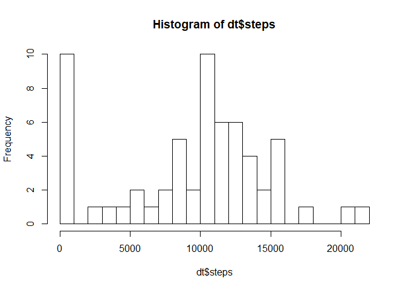
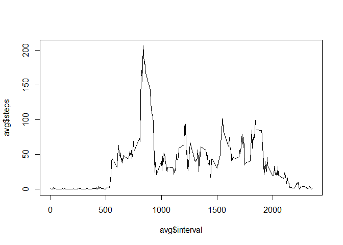
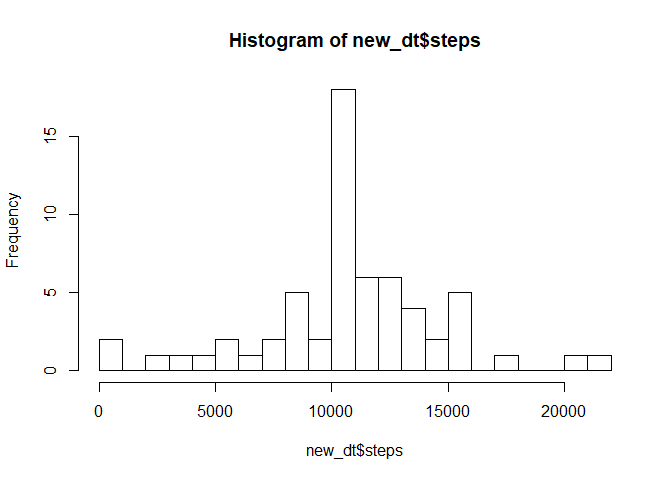
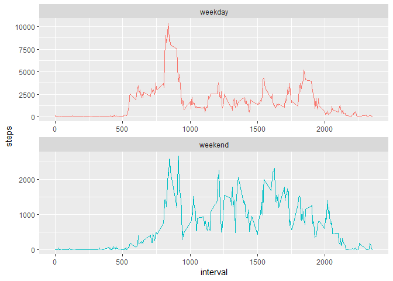

```r
require(ggplot2)
```

```
## Loading required package: ggplot2
```

```r
require(xtable)
```

```
## Loading required package: xtable
```

```r
require(dplyr)
```

```
## Loading required package: dplyr
```

```
## 
## Attaching package: 'dplyr'
```

```
## The following objects are masked from 'package:stats':
## 
##     filter, lag
```

```
## The following objects are masked from 'package:base':
## 
##     intersect, setdiff, setequal, union
```

```r
library(stringr)
```

### Loading and preprocessing the data

1. Load the data (i.e. read.csv())
2. Process/transform the data (if necessary) into a format suitable for your analysis


```r
my_data <- read.csv("C:/One-Drive/OneDrive - Tredence/TALL/02 JHU/knitr/activity.csv",
                    stringsAsFactors = F,
                    header = T)
```

```r
print(xtable(head(my_data)), type = 'html')
```

<!-- html table generated in R 3.5.1 by xtable 1.8-3 package -->
<!-- Tue Jan 29 22:05:18 2019 -->
<table border=1>
<tr> <th>  </th> <th> steps </th> <th> date </th> <th> interval </th>  </tr>
  <tr> <td align="right"> 1 </td> <td align="right">  </td> <td> 2012-10-01 </td> <td align="right">   0 </td> </tr>
  <tr> <td align="right"> 2 </td> <td align="right">  </td> <td> 2012-10-01 </td> <td align="right">   5 </td> </tr>
  <tr> <td align="right"> 3 </td> <td align="right">  </td> <td> 2012-10-01 </td> <td align="right">  10 </td> </tr>
  <tr> <td align="right"> 4 </td> <td align="right">  </td> <td> 2012-10-01 </td> <td align="right">  15 </td> </tr>
  <tr> <td align="right"> 5 </td> <td align="right">  </td> <td> 2012-10-01 </td> <td align="right">  20 </td> </tr>
  <tr> <td align="right"> 6 </td> <td align="right">  </td> <td> 2012-10-01 </td> <td align="right">  25 </td> </tr>
   </table>

```r
my_data$date <- as.Date(my_data$date, format = "%Y-%m-%d")
```


This data has NAs at night because, obviously the guys is sleeping. We can have a rough estimate of the guy's sleeping pattern and then impute that duration with 0. The remaing time stamps, if there, can be imputed with required values.

### What is mean total number of steps taken per day?
For this part of the assignment, you can ignore the missing values in the dataset.


#### Calculate the total number of steps taken per day


```r
dt <- my_data %>% 
    group_by(date) %>% 
    summarise(steps = sum(steps,na.rm = T))
```

#### Make a histogram of the total number of steps taken each day


```r
hist(dt$steps,breaks = 30)
```

<!-- -->

  
#### Calculate and report the mean and median of the total number of steps taken per day


```r
mean_dt <- mean(dt$steps,na.rm = T)
median_dt <- median(dt$steps,na.rm = T)
```

Mean is 9354.2295082  
Median is 10395  

### What is the average daily activity pattern?

#### Make a time series plot (i.e. type="l") of the 5-minute interval (x-axis) and the average number of steps taken, averaged across all days (y-axis)


```r
avg <- my_data %>% 
    group_by(interval) %>% 
    summarise(steps = mean(steps,na.rm = T))

plot(avg$interval, avg$steps, type = 'l')
```

<!-- -->

#### Which 5-minute interval, on average across all the days in the dataset, contains the maximum number of steps?

```r
n <- avg[which.max(avg$steps),'interval']
```
  
  The maximum steps is recorded at 835 hours.


### Imputing missing values
Note that there are a number of days/intervals where there are missing values (coded as NA). The presence of missing days may introduce bias into some calculations or summaries of the data.

#### Calculate and report the total number of missing values in the dataset (i.e. the total number of rows with NAs)


```r
n <- sum(is.na(my_data$steps))
```

There are 2304 NAs in the dataset.

#### Devise a strategy for filling in all of the missing values in the dataset. The strategy does not need to be sophisticated. For example, you could use the mean/median for that day, or the mean for that 5-minute interval, etc.

My strategy is to fill the mean of the interval across all the days. This will help us maintain the daily sleeping clock of the subject.
For this I'm going to use the variable avg created earlier.


```r
names(avg) <- c("interval","mean_steps")
my_data2 <- my_data %>% 
    left_join(avg, by = 'interval')

sum(is.na(my_data$mean_steps)) # Checking if all the imputed values are present or not
```

```
## [1] 0
```

```r
my_data2$final_steps <- ifelse(is.na(my_data2$steps),my_data2$mean_steps,my_data2$steps)
```

#### Create a new dataset that is equal to the original dataset but with the missing data filled in.


```r
my_new_data <- my_data2 %>% 
    select(final_steps,date,interval) %>% 
    rename(steps = final_steps)
rm(my_data2)
```

#### Make a histogram of the total number of steps taken each day and Calculate and report the mean and median total number of steps taken per day. Do these values differ from the estimates from the first part of the assignment? What is the impact of imputing missing data on the estimates of the total daily number of steps?


```r
new_dt <- my_new_data %>% 
    group_by(date) %>% 
    summarise(steps = sum(steps,na.rm = T))

hist(new_dt$steps,breaks = 30)
```

<!-- -->

```r
new_mean_dt <- mean(dt$steps,na.rm = T)
new_median_dt <- median(dt$steps,na.rm = T)

new_mean_dt == mean_dt
```

```
## [1] TRUE
```

```r
new_median_dt == median_dt
```

```
## [1] TRUE
```

Yes, the new means and medians are the same as above. However, the histogram has changed.

###Are there differences in activity patterns between weekdays and weekends?
For this part the weekdays() function may be of some help here. Use the dataset with the filled-in missing values for this part.

#### Create a new factor variable in the dataset with two levels - "weekday" and "weekend" indicating whether a given date is a weekday or weekend day.


```r
my_new_data <- my_new_data %>% 
    mutate(weekday = weekdays(date)) %>%
    rowwise() %>% 
    mutate(week = ifelse(weekday %in% c("Saturday","Sunday"),"weekend","weekday")) %>% 
    select(-weekday)

my_new_data$week <- as.factor(my_new_data$week)
```

#### Make a panel plot containing a time series plot (i.e. type="l") of the 5-minute interval (x-axis) and the average number of steps taken, averaged across all weekday days or weekend days (y-axis). See the README file in the GitHub repository to see an example of what this plot should look like using simulated data.


```r
week_plot <- my_new_data %>% 
    group_by(week, interval) %>% 
    summarise(steps = sum(steps,na.rm = T))
```

```
## Warning: Grouping rowwise data frame strips rowwise nature
```

```r
# par(mfrow = c(2, 1))
# plot(avg$interval, avg$steps, type = 'l')
ggplot(week_plot, aes(interval, steps, colour = factor(week))) +
    geom_line() + facet_wrap(~ week, nrow = 2, scales = "free") +
    guides(colour = "none") +
    theme()
```

<!-- -->


### Thanks
